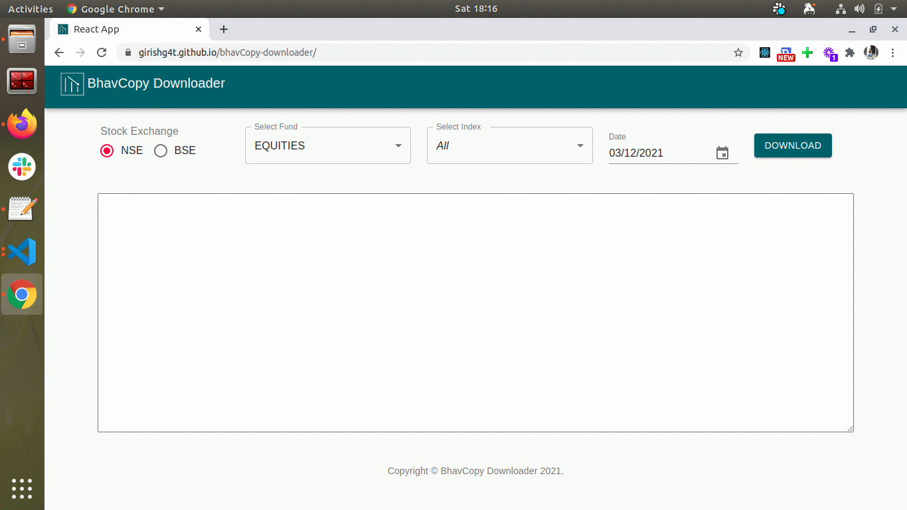

# BhavCopy Downloader

Getting stocks end of the data from NSE and BSE is difficult, i wanted to make that simple, customize, public and free, so that any one can download that easily and download the data as per there need.

### Approach 
#### Backend: 
It is written in golang which makes an an api call to NSE and BSE to get all stocks end of the day data. ones the data is received it is stored in AWS. Based on the api request the data is then send in csv format.

#### Frontend:
It is written in react, which allows use to download the data based on there choice, below are the steps he/she need to perform, default is all stock download. 
  
    
1) Select the Stock Exchange from which the data is required eg. NSE/BSE
2) Select Fund for the particular exchange, currently it is configured for Equity only, in future more options will be added
3) Select the Index for which the data is required default is All, current configured index are  
<table>
  <tr>
    <td colspan="5">NSE</td>
    <td>BSE</td>
  </tr>
  <tr>
    <td colspan="5">"AUTO",
        "BANK",
        "CONSUMERDURABLES",
        "FINANCE",
        "FINANCIAL_SERVICES",
        "FMCG",
        "HEALTHCARE",
        "IT",
        "MEDIA_ENTERTAINMENT",
        "METAL",
        "OIL_GAS",
        "PHARMA",
        "PRIVATE_BANK",
        "PSU_BANK",
        "REALTY",
        "NIFTY50",
        "NIFTY100",
        "NIFTY200",
        "NIFTY500",
        "NIFTY500_MULTICAP_50_25_25",
        "NIFTY_LARGE_MIDCAP250",
        "NIFTY_MIDCAP50",
        "NIFTY_MIDCAP100",
        "NIFTY_MIDCAP150",
        "NIFTY_MID_SMALLCAP400",
        "NIFTY_NEXT50",
        "NIFTY_SMALLCAP50",
        "NIFTY_SMALLCAP100",
        "NIFTY_SMALLCAP250"</td>
         <td colspan="4">"AUTO",
        "BANKS",
        "BASIC_MATERIALS",
        "CAPITAL_GOODS",
        "CONSUMER_DISCRETIONARY_GOODS_SERVICES",
        "CONSUMER_DURABLES",
        "ENERGY",
        "FINANCE",
        "FMCG",
        "HEALTHCARE",
        "INDUSTRIALS",
        "IT",
        "METAL",
        "OIL_GAS",
        "POWER",
        "REALTY",
        "TECK",
        "TELECOM",
        "UTILITIES",
        "BSE100",
        "BSE200",
        "BSE500",
        "BSE_ AllCap",
        "BSE_LARGECAP",
        "BSE_LARGE_MIDCAP",
        "BSE_MIDCAP",
        "BSE_MIDCAP_SELECT_INDEX",
        "BSE_MID_SMALLCAP",
        "BSE_SENSEX",
        "BSE_SENSEX_50",
        "BSE_SMALLCAP",
        "BSE_SMALLCAP_SELECT_INDEX"</td>
  </tr>
</table>

4) Selected date, to download the specific date data   
5) Click on download to save the csv file.

### In Action 


### How to run

```sh
npm start
```

## Contributing

As you know that stocks in index get change and keeping that up to date is not a one person job, that's why i have made all this configurable.
There are 2 folders "./src/NSEIndexConfigs"  and "./src/BSEIndexConfigs" in which all the index stocks configuration are present eg. Auto, Nifty50, BSE100 etc.

You can make changes to config by adding/removing the stock as per NSE and BSE changes or create the customized config and create the pull request to make it public.

Also there is "./src/config.json" in which UI related config are present.

We love your input! We want to make contributing to this project as easy and transparent as possible.
- Reporting a bug
- Discussing the current state of the code
- Submitting a fix
- Proposing new features